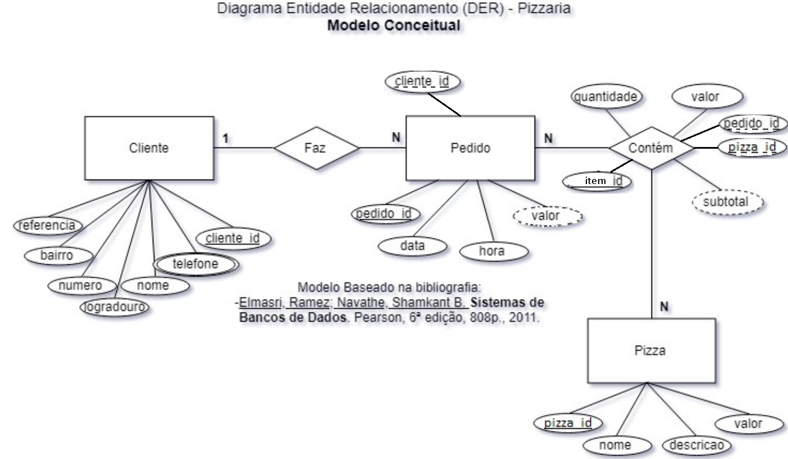

# Pizzaria Pizzaria Ginno e Silva
Exemplo de projeto Back-end com Node.js, Prisma e XAMPP para registro e controle de pedidos de uma pizzaria.

## Contextualização
Contextualização:
A pizzaria Pizzaria Ginno e Silva deseja um sistema para gerenciar seus pedidos para delivery. Você faz parte de uma equipe de desenvolvimento e atua como programador back-end. O P.O. da equipe elaborou o DER abaixo para o banco de dados do sistema.


## Tecnologias
- Node.js
- Prisma
- XAMPP
- MySQL
- VsCode
- Insomnia

## Como testar
- 1 Clone este **repositório**
- 2 Abra o **XAMPP** Control Panel e inicie o Apache e o MySQL
- 3 Abra com o repositorio com **VsCode**
- 4 Crie o arquivo .env na pasta API e adicione as seguintes variáveis de ambiente
```js
DATABASE_URL="mysql://root@localhost:3306/pizzaria?schema=public&timezone=UTC"
```
- 5 Abra o terminal **CTRL + '** cmd ou bash, navegue até a pasta API e execute os comandos
````bash
cd api
npm install
npx prisma migrate dev --name init
npx nodemon
# ou
npm start
````
- 6 Abra o **Insomnia** e importe o arquivo **./docs/insomnia.json** para testar as rotas.
- 7 Caso queira visualizar o banco de dados, abra o **XAMPP** Control Panel e clique em **Admin** no módulo MySQL.
    - O arquivo ./docs/testes.sql é um script com dados de teste para inserir no banco de dados.
- 8 Para parar a execução do servidor, pressione **CTRL + C** no terminal.

## OBs
